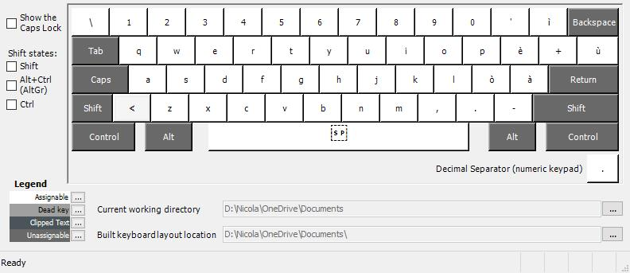
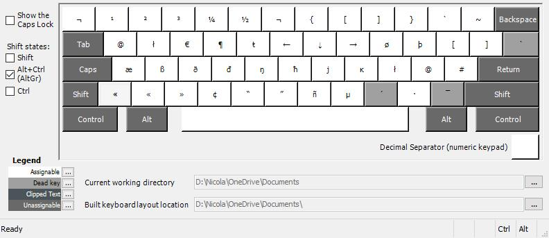
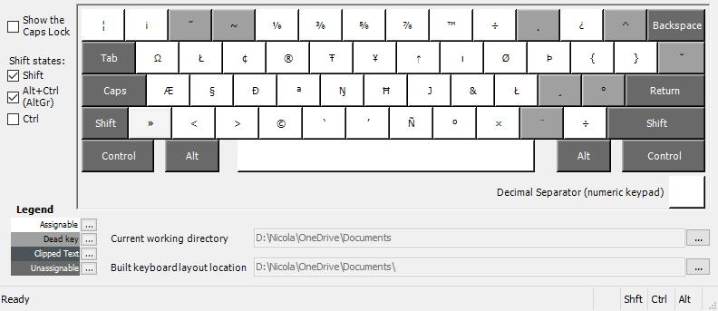

Italian Linux Keyboard for Windows
=======

An Italian keyboard layout for Windows, which reproduces the standard Italian Linux layout.

## Why

This layout is extremely useful if your physical keyboard is Italian and you need to write non-Italian characters.

It provides the extra characters for most languages that use the latin alphabet (such as "ß" in German, "ê" in French or "ű" in Hungarian), and the ones for programming languages and shells.

## Installation

To install the keyboard download the [it_kbrd](./it_kbrd) dirctory, double-click on the [setup](./it_kbrd/setup.exe) file and proceed with the installation dialogue.

To add the keyboard as an input method type "Settings" in the Windows search bar and select **Settings** > **Time & Language** > **Language**.

Under **Preferred languages**, select **Italian**, and then select **Options**. Select **Add a keyboard** and choose **Italian (Linux)**.

### From Source

You can build the [it_keyboard](./src/it_keyboard.klx) file in the [src](./src) directory using the [MSKLC](https:*www.microsoft.com/en-us/download/details.aspx?id=22339) tool.

## Usage

### Default

### Shift

### AltGr

### Shft + AltGr

## Dead Keys

The grey keys in the picture are "dead keys". This means that the symbols on them can be combined with different letters.

For instance, if you first press **Tilde** (**~**, i.e. **Shft** + **Alt-Gr** + **ù**) and then press **a**, **e**, **i** etc., you will obtain the characters "ă", "ĕ", "ĭ" etc.

If you want the standalone symbol (not combined with any letter) type the corresponding dead key followed by a space.

Here is a list of the dead keys and the letters that they can be combined with:

### Double Acute Accent ˝ (AltGr + Shft + 2)

* O -> Ő
* o -> ő
* U -> Ű
* u -> ű

### Tilde ~ (AltGr + Shft + 3)

* A -> Ã
* a -> ã
* E -> Ẽ
* I -> Ĩ
* i -> ĩ
* U -> Ũ
* u -> ũ
* O -> Õ
* o -> õ
* e -> ẽ
* Y -> Ỹ
* y -> ỹ
* N -> Ñ
* n -> ñ

### Ogonek ˛ (AltGr + Shft + 0)

 * A -> Ą
 * a -> ą
 * E -> Ę
 * e -> ę
 * I -> Į
 * i -> į
 * O -> Ǫ
 * o -> ǫ
 * U -> Ų
 * u -> ų

### Circumflex Accent ^ (AltGr + Shft + ì)

* A -> Â
* a -> â
* E -> Ê
* e -> ê
* I -> Î
* i -> î
* O -> Ô
* o -> ô
* U -> Û
* u -> û
* W -> Ŵ
* w-> ŵ
* Y -> Ŷ
* y -> ŷ
* S -> Ŝ
* s -> ŝ
* G -> Ĝ
* g -> ĝ
* H -> Ĥ
* h -> ĥ
* J -> Ĵ
* j -> ĵ
* Z -> Ẑ
* z -> ẑ
* C -> Ĉ
* c -> ĉ

### Cedilla ¸ (AltGr + Shft + ò)

* e -> ȩ
* R -> Ŗ
* r -> ŗ
* t -> ţ
* S -> Ş
* s -> ş
* D -> Ḑ
* d -> ḑ
* G -> Ģ
* g -> ģ
* H -> Ḩ
* h -> ḩ
* K -> Ķ
* k -> ķ
* L -> Ļ
* l -> ļ
* C -> Ç
* c -> ç
* N -> Ņ
* n -> ņ

### Degree Sign ° (AlgGr + Shft + à)

* A -> Å
* a -> å
* U -> Ů
* u -> ů
* w -> ẘ
* y -> ẙ

### Grave Accent ` (AltGr + ù)

* A -> À
* a -> à
* E -> È
* e -> è
* I -> Ì
* i -> ì
* O -> Ò
* o -> ò
* U -> Ù
* u -> ù
* W -> Ẁ
* w -> ẁ
* N -> Ǹ
* n -> ǹ

### Breve ˘ (AltGr + Shft + ù)

* A -> Ă
* a -> ă
* E -> Ĕ
* e -> ĕ
* I -> Ĭ
* i -> ĭ
* O -> Ŏ
* o -> ŏ
* U -> Ŭ
* u -> ŭ
* G -> Ğ
* g -> ğ

### Acute Accent ´ (AltGr + ,)

* A -> Á
* a -> á
* E -> É
* e -> é
* I -> Í
* i -> í
* O -> Ó
* o -> ó
* U -> Ú
* u -> ú
* W -> Ẃ
* w -> ẃ
* R -> Ŕ
* r -> ŕ
* Y -> Ý
* y -> ý
* P -> Ṕ
* p -> ṕ
* S -> Ś
* s -> ś
* K -> Ḱ
* k -> ḱ
* L -> Ĺ
* l -> ĺ
* Z -> Ź
* z -> ź
* C -> Ć
* c -> ć
* N -> Ń
* n -> ń
* M -> Ḿ
* m -> ḿ

### Diaeresis ¨ (AltGr + Shft + .)

* A -> Ä
* a -> ä
* E -> Ë
* e -> ë
* I -> Ï
* i -> ï
* O -> Ö
* o -> ö
* U -> Ü
* u -> ü
* W -> Ẅ
* w -> ẅ
* t -> ẗ
* Y -> Ÿ
* y -> ÿ
* H -> Ḧ
* h -> ḧ
* X -> Ẍ
* x -> ẍ

### Macron ¯ (AltGr + Shft + -)

* A -> Ā
* a -> ā
* E -> Ē
* e -> ē
* I -> Ī
* i -> ī
* O -> Ō
* o -> ō
* U -> Ū
* u -> ū
* Y -> Ȳ
* y -> ȳ
* G -> Ḡ
* g -> ḡ

## License

MIT

© Nicola Carraro 2020
